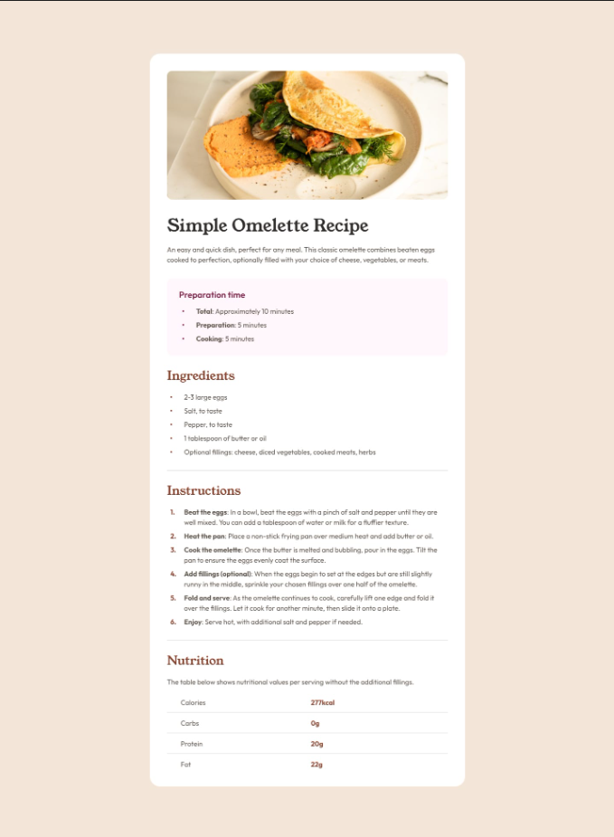

# Frontend Mentor - Recipe page solution

This is a solution to the [Recipe page challenge on Frontend Mentor](https://www.frontendmentor.io/challenges/recipe-page-KiTsR8QQKm). Frontend Mentor challenges help you improve your coding skills by building realistic projects. 

#

### Screenshot

## Links
- Live Site URL: [Add live site URL here](https://your-live-site-url.com)

## My process
So this is my second challenge submission for Frontend Mentor, an excellent site for project practice.
The main highlight of my approach was designing a layout that adapts seamlessly to different screen sizes. I achieved this by:

- Using relative units like em(which was recomended to me by many helpful people) for fluid scaling.

- Downloading fonts using Google Font and applying them.

- Implementing media queries to adjust layout behavior on smaller screens.

- Ensuring the image scales responsively using object-fit: cover and dynamic height adjustments.

- Eliminating unwanted spacing (like default body margins) to create a tight, clean top alignment, especially for the header image.

Throughout the process, I tested the layout on multiple screen widths (mobile, tablet, desktop) to verify consistency. The final design ensures content readability and aesthetic balance across all devices.
### Built with

- Semantic HTML5 markup
- CSS custom properties
- Flexbox
- CSS Grid

### What I learned

through this project, I gained hands-on experience in building a responsive web page from scratch. Some of the key things I learned include:

- How to use object-fit: cover effectively to ensure images scale and fill containers properly without distortion.
- how to download fonts from Googl Safely

- The importance of removing default browser styles (like body margin) to achieve a clean, edge-to-edge design.

- How to structure HTML semantically for better accessibility and readability.

- using media queries to adapt typography, spacing, and layout based on screen sizes.

## Acknowledgments

I would like to express my gratitude to Frontend Mentor for providing the design challenge, which helped me enhance my skills in responsive web development. I also appreciate the online developer community whose shared resources and discussions guided me in solving layout and responsiveness issues.

Special thanks to everyone who gave constructive feedback and support during the development process.

